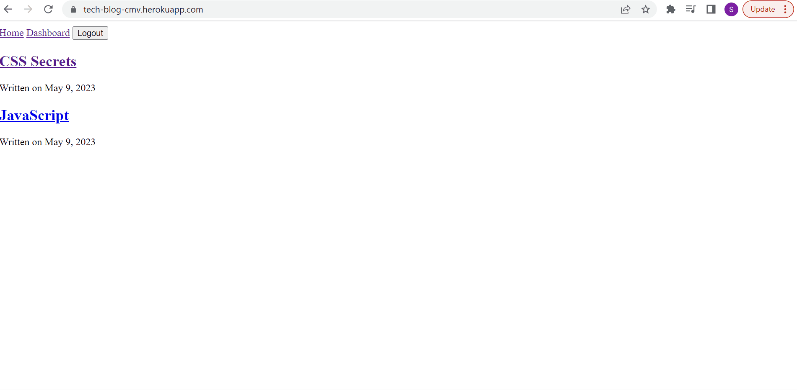

# tech-blog
Full-stack tech blog application

| Technology Used         | Resource URL           | 
| ------------- |:-------------:| 
| JavaSCript    | [https://developer.mozilla.org/en-US/docs/Web/HTML](https://developer.mozilla.org/en-US/docs/Web/HTML) | 
| Node.js    | [https://developer.mozilla.org/en-US/docs/Web/CSS](https://developer.mozilla.org/en-US/docs/Web/CSS)      |   
| Git | [https://git-scm.com/](https://git-scm.com/)     |   
| dotenv | [https://www.npmjs.com/package/dotenv](https://www.npmjs.com/package/dotenv)     | 
| sequelize | [https://sequelize.org/](https://sequelize.org/)     | 
| Insomnia | [https://insomnia.rest/](https://insomnia.rest/)     | 
| Express.js | [https://expressjs.com/](https://expressjs.com/)     |
| mysql2 | [https://www.npmjs.com/package/mysql2](https://www.npmjs.com/package/mysql2)     |    

## Description 

[Visit the Deployed Site](https://tech-blog-cmv.herokuapp.com/)

Full stack tech blog application. Create an account, login, view other users blog posts, create your own blog posts, comment on other users posts, delete and update your own.  

## Table of Contents 

* [Installation](#installation)
* [Usage](#usage)
* [Learning Points](#learning-points)
* [Author Info](#author-info)
* [Credits](#credits)
* [License](#license)

## Installation

npm i 

Create a .env file

Run schema.sql script

npm run seeds

npm start

## Usage 

Create a blog post and stay up to date on the latest tech trends and information.

If signing up for the first time type your user credentials into the login form

## Learning Points 
This was my first time ever creating a full stack application from scratch. It was a journey and I learned a lot.  In the future I would like to add some CSS to create a better UI. 
* handlebars 
* MVC model
* more on routes
* document.location
* Heroku and mysql 

## Author Info

### Shea Schwennicke

* [Portfolio](https://sheaschwenn.github.io/Portfolio/)
* [LinkedIn](https://www.linkedin.com/in/shea-schwennicke-76a378210/)
* [Github](https://github.com/sheaschwenn)

## License
MIT License 

Check LICENSE in the repo for more information. 

